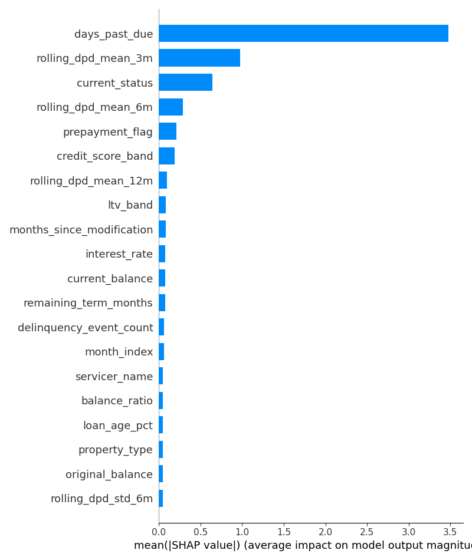
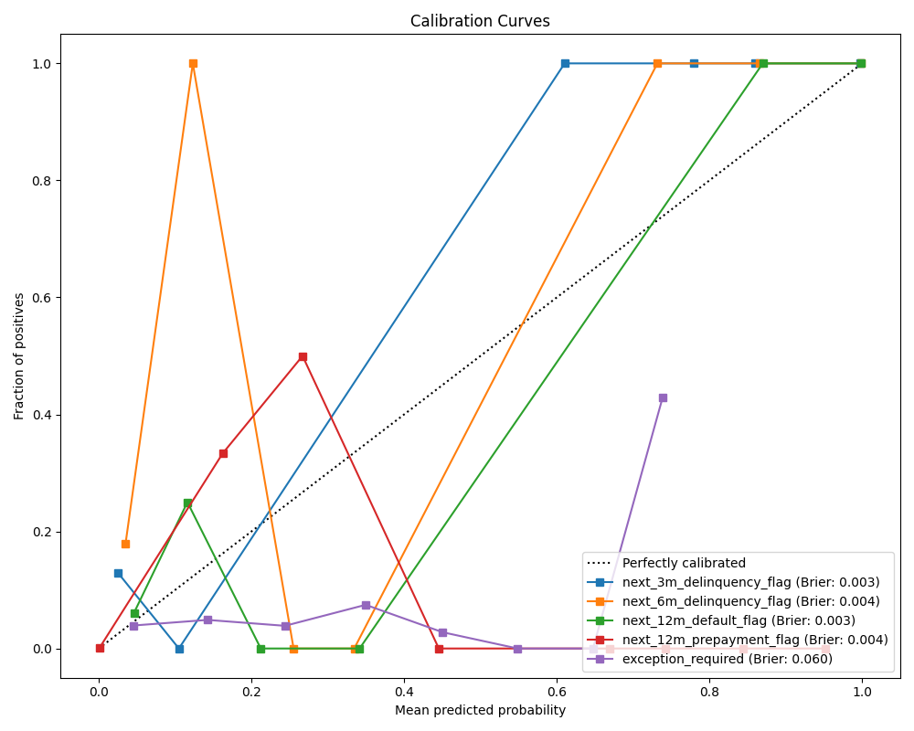

# Explainability & Fairness Report

This report details the model explainability, calibration, error analysis, fairness, and confidence metrics.

## 1. Global Feature Importance (SHAP)

Top 15 Features:
| Rank | Feature | Mean Absolute SHAP |
|---|---|---|
| 1 | days_past_due | 3.4797 |
| 2 | rolling_dpd_mean_3m | 0.9756 |
| 3 | current_status | 0.6394 |
| 4 | rolling_dpd_mean_6m | 0.2859 |
| 5 | prepayment_flag | 0.2134 |
| 6 | credit_score_band | 0.1871 |
| 7 | rolling_dpd_mean_12m | 0.0956 |
| 8 | ltv_band | 0.0860 |
| 9 | months_since_modification | 0.0812 |
| 10 | interest_rate | 0.0753 |
| 11 | current_balance | 0.0745 |
| 12 | remaining_term_months | 0.0736 |
| 13 | delinquency_event_count | 0.0601 |
| 14 | month_index | 0.0588 |
| 15 | servicer_name | 0.0506 |

## 2. Model Calibration

For **next_12m_default_flag**, the Brier score is **0.0032**.

## 3. Error Analysis
For **next_12m_default_flag** at threshold 0.5:
- False Positives: 0
- False Negatives: 5

### False Negative Examples
      loan_age_months  remaining_term_months  original_balance  current_balance  interest_rate  days_past_due  month_index  modification_flag  prepayment_flag  default_flag  balance_ratio  rate_spread  loan_age_pct  rolling_dpd_mean_3m  rolling_dpd_mean_6m  rolling_dpd_mean_12m  rolling_dpd_std_6m  delinquency_event_count  servicer_conflict_flag  balance_change_pct  months_since_modification  credit_score_band  ltv_band  dti_band  state  loan_purpose  occupancy_type  property_type  servicer_name  current_status  loss_severity_band  document_status
322              61.0                  299.0          152000.0    126244.444444           5.25            0.0         60.0                0.0              0.0           0.0       0.830556         0.63      0.169444                  0.0                 45.0             60.000000           49.295030                     22.0                       1           -0.003333                        1.0                  2         2         4     13             1               2              3              3               3                   4                1
514              56.0                  304.0          224000.0    189155.555556           4.04           30.0         55.0                0.0              0.0           0.0       0.844444        -0.58      0.155556                 30.0                 30.0             30.000000            0.000000                     38.0                       0           -0.003279                       10.0                  2         4         0     10             1               0              3              0               0                   4                1
784              73.0                  287.0          449000.0    357952.777778           4.45           30.0         26.0                0.0              0.0           0.0       0.797222        -0.17      0.202778                 30.0                 30.0             13.636364            0.000000                     34.0                       1           -0.003472                       22.0                  2         2         0      1             2               2              1              2               0                   4                2
957              53.0                  307.0          164000.0    139855.555556           2.75            0.0         52.0                0.0              0.0           0.0       0.852778        -1.87      0.147222                  0.0                  0.0              0.000000            0.000000                     14.0                       1           -0.003247                        9.0                  2         4         2     11             2               0              2              0               3                   4                0
1016             78.0                  282.0          393000.0    307850.000000           5.36           30.0         77.0                0.0              0.0           0.0       0.783333         0.74      0.216667                 30.0                 30.0             60.000000           32.863353                     56.0                       1           -0.003003                        4.0                  1         4         1     14             2               2              0              2               0                   4                3

## 4. Fairness / Bias Analysis (Demographic Parity)
For **next_12m_default_flag**:
### Protected Attribute: `state`
**Demographic Parity Difference:** 0.2208

| Group | Positive Prediction Rate |
|---|---|
| AZ | 1.0000 |
| CA | 0.8305 |
| FL | 0.9800 |
| GA | 1.0000 |
| IL | 1.0000 |
| IN | 0.9545 |
| MA | 1.0000 |
| MD | 0.9780 |
| MI | 1.0000 |
| MO | 1.0000 |
| NC | 0.9130 |
| NJ | 0.9121 |
| NY | 0.8989 |
| OH | 0.7792 |
| PA | 0.9383 |
| TN | 1.0000 |
| TX | 0.9583 |
| VA | 1.0000 |
| WA | 1.0000 |
| WI | 1.0000 |

### Protected Attribute: `credit_score_band`
**Demographic Parity Difference:** 0.2743

| Group | Positive Prediction Rate |
|---|---|
| 620-659 | 1.0000 |
| 660-699 | 0.9711 |
| 700-739 | 0.7257 |
| 740-779 | 0.9862 |
| 780+ | 0.9628 |
| <620 | 1.0000 |

## 5. Prediction Confidence
For **next_12m_default_flag**:
- Mean Probability: 0.9535
- Std Dev Probability: 0.1990
- % of Predictions in Uncertain Zone (0.3-0.7): 0.06%
